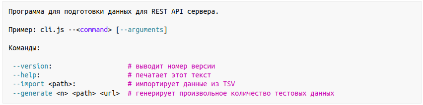

# Техническое задание проекта «Шесть городов»

---

## О проекте

«Шесть городов» — сервис для путешественников, не желающих переплачивать за аренду жилья. Выбирайте один из шести популярных городов для путешествий и получайте актуальный список предложений по аренде.

---

## Описание функциональности

## 1. Задача

1.1. Разработать сервис для проекта «Шесть городов».

1.2. Сервис предоставляет REST API интерфейс и CLI интерфейс.

---

## 2. Сценарии

2.1. Создание нового предложения.

2.2. Редактирование предложения.

2.3. Удаление предложения.

2.4. Получение списка предложений по аренде.

2.5. Получение детальной информации о предложении.

2.6. Получение списка комментариев для предложения.

2.7. Добавление комментария для предложения.

2.8. Создание нового пользователя.

2.9. Вход в закрытую часть приложения.

2.10. Выход из закрытой части приложения.

2.11. Проверка состояния пользователя.

2.12. Получение списка премиальных предложений для города.

2.13. Получения списка предложений, добавленных в избранное.

2.14. Добавление/удаление предложения в/из избранное.

---

## 3. Сущности

### <a name="user">3.1.</a> Пользователь

3.1.1. Пользователь представлен набором информации:

- Имя. Обязательное. Мин. длина 1 символ, макс. длина 15 символов;
- Электронная почта. Обязательное. Валидный адрес электронной почты;
- Аватар пользователя. Необязательное. Изображение пользователя в формате `.jpg` или `.png`;
- Пароль. Обязательное. Мин. длина 6 символов, макс. длина 12 символов;
- Тип пользователя. Обязательное. Возможные варианты: обычный, pro. 

3.1.2. В приложении не может быть двух пользователей с одинаковым email.

3.1.3. Изображение для аватарки. Необязательное. Если пользователь не загрузил аватар, сервис возвращает изображение аватарки по умолчанию. Выбор изображения по умолчанию остаётся на усмотрение студента.

### <a name="offer">3.2.</a> Предложение по аренде

3.2.1. Предложение по аренде представлено набором информации:

- Наименование. Обязательное. Мин. длин 10 символов, макс. длина 100;
- Описание предложения. Обязательное. Мин. длина 20 символов, макс. длина 1024 символа;
- Дата публикации предложения. Обязательное.
- Город. Обязательное. Один из шести городов.
- Превью изображения. Обязательное. Ссылка на изображение, которое используется в качестве превью;
- Фотографии жилья. Обязательное. Список ссылок на фотографии жилья. Всегда 6 фотографий;
- Флаг «Премиум». Обязательное. Признак премиальности предложения;
- Флаг «Избранное». Обязательное. Признак того, что предложение принадлежит списку избранных предложений пользователя;
- Рейтинг. Обязательное. Число от 1 до 5. Допускаются числа с запятой (1 знак после запятой);
- Тип жилья. Обязательное. Один из вариантов: `apartment`, `house`, `room`, `hotel`;
- Количество комнат. Обязательное. Мин. 1, Макс. 8;
- Количество гостей. Обязательное. Мин. 1, Макс. 10;
- Стоимость аренды. Обязательное. Мин. 100, Макс. 100 000;
- Удобства. Обязательное. Список удобств. Один или несколько вариантов из списка: `Breakfast`, `Air conditioning`, `Laptop friendly workspace`, `Baby seat`, `Washer`, `Towels`, `Fridge`;
- <a href="#user">Автор предложения</a>. Обязательное. Ссылка на сущность «Пользователь»;
- Количество комментариев. Рассчитывается автоматически;
- Координаты предложения для аренды. Обязательное. Координаты представлены широтой и долготой.

3.2.2. Список городов и их географические координаты:

- Paris (latitude: 48.85661, longitude: 2.351499);
- Cologne (latitude: 50.938361, longitude: 6.959974);
- Brussels (latitude: 50.846557, longitude: 4.351697);
- Amsterdam (latitude: 52.370216, longitude: 4.895168);
- Hamburg (latitude: 53.550341, longitude: 10.000654);
- Dusseldorf (latitude: 51.225402, longitude: 6.776314).

### <a name="comment">3.3.</a> Комментарий

3.3.1. Комментарий представлен набором информации:

- Текст комментария. Обязательное. Мин. длина 5 символов, макс. длина 1024 символа;
- Дата публикации комментария. Обязательное. При создании комментария данное поле не используется;
- Рейтинг. Обязательное. Число от 1 до 5;
- <a href="#user">Автор комментария</a>. Обязательное. Ссылка на сущность «Пользователь».

---

## 4. Функциональность

### 4.1. Command Line Interface

4.1.1. Приложение предоставляет Command Line Interface (CLI). Для запуска CLI предусмотрен отдельный сценарий в `package.json` — `cli`.

4.1.2. Модуль, отвечающий за запуск CLI, содержит корректный shebang.

4.1.3. CLI поддерживает обработку аргументов:

`--version`. Выводит информацию о версии приложения. Информация о версии считывается из `package.json`. Пример вывода: `1.0.1`;  
`--help`. Выводит список и описание всех поддерживаемых аргументов. Оформление списка остаётся на усмотрение студента. Пример оформления продемонстрирован ниже.

</img>

`--generate <n> <filepath> <url>`. Создаёт файл в формате tsv с тестовыми данными. Параметр `n` задаёт количество генерируемых предложений. Параметр `filepath` указывает путь для сохранения файла с предложениями. Параметр `<url>` задаёт адрес сервера, с которого необходимо взять данные. Каждая строка в файле tsv содержит всю необходимую информацию для создания одного предложения по аренде (кроме комментариев).  
`--import <filepath>`. Импортирует в базу данных информацию из tsv-файла. Путь к файлу передаётся в параметре `filepath`.

4.1.4. Запуск CLI без аргументов приводит к исполнению команды `--help`.

### 4.2. REST API в формате OpenAPI

4.2.1. Приложение предоставляет REST API интерфейс. Имена ресурсов, маршрутов остаются на усмотрение студента.

4.2.2. Спецификация REST API представлена в формате OpenAPI.

4.2.3. Для описания спецификации используется язык YAML.

4.2.4. Спецификация сохранена в директории `specification` (в корне проекта).

### 4.3. REST API сервис

4.3.1. Сервис предоставляет ресурсы в соответствии со спецификацией.

4.3.2. Настройки, необходимые для запуска и работы сервиса, передаются с помощью переменных окружения.

4.3.3. Список всех переменных окружения приведён в файле `Workflow.md`, который расположен в корне проекта. Формат описания: `PARAM=value — описание`.

4.3.4. Для удобства передачи параметров окружения используются `.env`-файлы. Они не должны сохраняться в системе контроля версий.

4.3.5. В корне проекта расположен `.env.example`. Он содержит список всех переменных окружения, необходимых для работы приложения. Переменным заданы значения по умолчанию (для примера использования).

### 4. Запуск сервиса

4.4.1. При старте сервис проверяет список установленных переменных окружения. Если какая-то переменная не задана, сервис выдаёт сообщение об ошибке и прекращает выполнение.

4.4.2. В файле `Workflow.md` предусмотрите раздел «Запуск проекта» и опишите в нём подробную инструкцию по запуску проекта. Формат описания остаётся на усмотрение студента.

4.4.3. В файле `Workflow.md` в секции «Сценарии» перечислите все сценарии, доступные в package.json и опишите их предназначение.

В корневой директории проекта расположен файл `docker-compose.yml` для быстрого разворачивания базы данных MongoDB с помощью Docker (если вы используете в работе docker).

---

## 5. Список ресурсов

### 5.1. Создание нового предложения

5.1.1. Сервис предоставляет ресурс для создания новых предложений.

5.1.2. Создавать предложения могут только авторизованные клиенты.

5.1.3. Для создания нового предложения по аренде клиент передаёт информацию, указанную в пункте <a href="#offer">3.2.</a>

5.1.4. Перед созданием предложения данные, полученные от клиента, валидируются. Если валидация не пройдена, сервис возвращает ошибку и корректный код состояния. Предложение при этом не создаётся.

5.1.5. В случае успешного создания предложения сервис в ответе возвращает информацию о созданном предложении (объект предложения).

### 5.2. Редактирование предложения

5.2.1. Сервис предоставляет ресурс для редактирования предложения.

5.2.2. Клиент может редактировать предложения по аренде, созданные им.

5.2.3. При попытке отредактировать чужое предложение по аренде сервис возвращает ошибку и корректный код состояния.

5.2.4. Для редактирования предложения по аренде клиент передаёт обновлённую информацию по предложению, перечисленную в пункте <a href="#offer">3.2</a>, и идентификатор редактируемого предложения.

5.2.5. Полученные от клиента данные проходят валидацию. Если валидация не пройдена, сервис возвращает информацию об ошибке и корректный код состояния.

5.2.6. В случае успешного обновления предложения сервис возвращает клиенту обновлённый объект предложения.

5.2.7. Редактировать предложения по аренде могут только авторизованные клиенты.

### 5.3. Удаление предложения по аренде

5.3.1. Сервис предоставляет ресурс для удаления предложений по аренде. Клиент может удалять только свои предложения.

5.3.2. При попытке клиентом удалить предложение другого пользователя сервис возвращает ошибку и корректный код состояния.

5.3.3. При удалении предложения комментарии к предложению удаляются автоматически.

5.3.4. Удалять предложения могут только авторизованные клиенты.

### 5.4. Список предложений по аренде

5.4.1. По умолчанию сервис возвращает не больше `60` предложений по аренде.

5.4.2. Клиент может запросить больше предложений, указав нужное количество в параметре запроса.

5.4.3. Сервис всегда возвращает отсортированный список предложений по дате публикации (по убыванию).

5.4.4. Предложение не содержит список комментариев. Только информацию об их количестве. Для запроса комментариев к определённому предложению сервис предоставляет отдельный ресурс.

5.4.5. Список предложений по аренде могут запрашивать анонимные и авторизованные клиенты.

5.4.6. Список возвращаемых полей предложения: стоимость аренды, название, тип жилья, флаг, позволяющий определить принадлежность к избранным предложениям, дата публикации, город, превью изображения, флаг «Премиум», рейтинг, количество комментариев.

### 5.5. Детальная информация по предложению

5.5.1. Сервис предоставляет ресурс для получения детальной информации по одному предложению.

5.5.2. Информация по предложению содержит все поля, перечисленные в пункте <a href="#offer">3.2.</a>, а также флаг, позволяющий определить принадлежность к избранным предложениям.

5.5.3. Детальная информация по предложению включает сведения о количестве комментариев. Сами комментарии не включены.

5.5.4. Детальную информацию по предложению могут запрашивать авторизованные и анонимные клиенты.

### 5.6. Список комментариев для предложения

5.6.1. Сервис предоставляет ресурс для получения списка комментариев для определённого предложения.

5.6.2. Сервис всегда возвращает список из `50` (или меньше) последних комментариев.

5.6.3. Комментарии отсортированы по дате публикации (по убыванию). Сначала новые, потом старые.

5.6.4. Комментарий в списке представлен набором информации, перечисленной в пункте <a href="#comment">3.3</a>.

5.6.5. Комментарии могут запрашивать авторизованные и анонимные клиенты.

### 5.7. Добавление комментария

5.7.1 Сервис предоставляет ресурс для добавления комментариев к определённому предложению по аренде.

5.7.2. Добавлять комментарии могут только авторизованные клиенты.

5.7.3. Для добавления нового комментария к предложению клиент передаёт набор информации, указанный в пункте <a href="#comment">3.3</a>.

5.7.4. Перед добавлением комментария сервис валидирует данные. В случае ошибки валидации сервис возвращает ошибку и корректный код состояния.

5.7.5. В случае успешного добавления комментария сервис возвращает информацию о созданном комментарии (объект комментария).

5.7.6. Удаление и редактирование комментариев не предусмотрено.

### 5.8. Создание нового пользователя

5.8.1. Сервис предоставляет ресурс для создания нового пользователя.

5.8.2. Для создания нового пользователя клиент отправляет запрос и передаёт данные, указанные в пункте <a href="#user">3.1</a>.

5.8.3. Создавать новых пользователей могут только анонимные клиенты.

5.8.4. Email создаваемого пользователя уникален. В системе не может быть двух пользователей с одинаковым email.

5.8.5. Данные, полученные от клиента, проходят валидацию. Если проверка не пройдена, сервер возвращает ошибку и корректный код состояния.

5.8.6. В случае успешного создания пользователя сервис возвращает информацию о созданном пользователе (объект пользователя). Возвращаемая информация не содержит конфиденциальных данных (например, пароль).

5.8.7. Пароль пользователя не хранится в базе данных в открытом виде. Вместо этого хранится хеш пароля.

### 5.9 Вход в закрытую часть приложения

5.9.1. Сервис предоставляет ресурс для аутентификации и авторизации пользователя.

5.9.2. Для входа в закрытую часть приложения клиент передаёт логин (email) и пароль пользователя.

5.9.3. Если логин или пароль неверный или пользователь не существует, сервер возвращает ошибку и соответствующий код состояния.

5.9.4. В случае успешной проверки логина и пароля сервис возвращает клиенту токен.

5.9.5. Клиент использует этот токен для отправки любых запросов. Токен передаётся в заголовках.

### 5.10 Выход из закрытой части приложения (только если авторизация выполняется на основе сессий)

5.10.1. Сервис предоставляет ресурс для завершения пользовательского сеанса.

5.10.2. Ресурс доступен только авторизованным клиентам.

5.10.3. Если токен прошёл проверку, сервис завершает пользовательский сеанс (сессию). В противном случае возвращает ошибку и соответствующий код состояния.

### 5.11 Проверка состояния пользователя

5.11.1. Сервис предоставляет ресурс для проверки состояния клиента — авторизован или нет.

5.11.2. Проверка состояния клиента производится на основании сессионного токена.

5.11.3. Если клиент авторизован, сервис возвращает соответствующий код состояния и информацию о пользователе (смотри пункт <a href="#user">3.1</a>). Информация о пользователе не должна содержать конфиденциальные данные (например, пароль).

### 5.12 Премиальные предложения для города

5.12.1. Сервис предоставляет ресурс для получения списка премиальных предложений для определённого города. Премиальное предложение — предложение с флагом «Premium».

5.12.2. Сервис возвращает не больше `3` предложений с флагом «Premium».

5.12.3. Список возвращаемых предложений отсортирован по дате публикации (по убыванию).

5.12.4. Ресурс доступен авторизованным и анонимным клиентам.

5.12.5. Список возвращаемых полей для предложения соответствует пункту 5.4.6.

### 5.13 Список избранных предложений

5.13.1. Сервис предоставляет ресурс для получения предложений, добавленных в избранное.

5.13.2. Сервис возвращает все предложения, добавленные в избранное.

5.13.3. Список возвращаемых полей для предложения соответствует пункту 5.4.6.

5.13.4. Ресурс доступен только авторизованным клиентам.

### 5.14 Добавление и удаление предложения в/из избранного

5.14.1. Сервис предоставляет ресурс для добавления и удаления любого предложения в/из списка избранных предложений.

5.14.2. Ресурс доступен только авторизованным клиентам.

---

## 6. Валидация

6.1. Данные, полученные от клиента, проверяются перед использованием (приводятся к нужному типу, проверяются идентификаторы для связанных сущностей и так далее).

6.2. Данные, которые не удовлетворяют правилам валидации, не могут использоваться для создания или редактирования сущностей. В таких ситуациях сервис возвращает ошибку и соответствующий код состояния.

---

## 7. Ошибки

7.1. В случае невозможности выполнения запроса сервис возвращает клиенту ошибку или список ошибок. Ответ с ошибкой содержит описание ошибки и соответствующий код состояния.

7.2. Формат описания ошибок и их детализация остаются на усмотрение студента.

---

## 8. Технические требования

8.1. Проект запускается и работает в актуальной версии Node.js.

8.2. Для разработки проекта используется TypeScript.

8.3. Для хранения данных используется MongoDB.

8.4. Для обработки запросов от клиентов используется Express.js.

8.5. Для работы с большими файлами (или файлами, которые потенциально могут стать большими) используются потоки (Streams).

8.6. В коде не должно быть зашито данных, которые могут меняться при переносе в продуктовую среду. Например: доступы для подключения к СУБД, адрес сервера для получения тестовых данных и так далее. Все перечисленные данные должны устанавливаться через переменные окружения.
